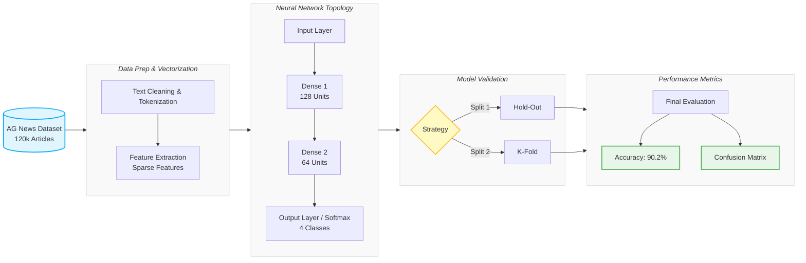

# Deep Learning Text Classification: AG News

A lightweight portfolio version of a Level 6 Machine Learning and Neural Networks coursework project. The project trains and evaluates a deep learning model for multiclass text classification using the AG News dataset.

## Project Overview

The goal of this project is to classify news articles into one of four categories:

- World
- Sports
- Business
- Sci/Tech

The model uses article titles and descriptions as input text and predicts the corresponding news category.

This repository includes two notebook versions:

| Notebook | Purpose |
|---|---|
| `DeepLearningModel.ipynb` | Cleaned coursework/report version, preserved as the full project record. |
| `DeepLearningModel_lightweight_rerun-Copy1.ipynb` | Lightweight rerun version designed for easier reproduction and portfolio review. |

## Key Results

| Metric | Result |
|---|---:|
| Classification task | 4-class text classification |
| Baseline accuracy | 25% |
| Final test accuracy | ~90% |
| Model architecture | 128 → 64 → 4 |
| Activation functions | ReLU → ReLU → Softmax |
| Optimizer | RMSprop |
| Loss function | Categorical crossentropy |
| Epochs | 3 |

The final model achieved approximately **90% test accuracy**, significantly above the 25% baseline expected for a balanced four-class classification problem.

## Dataset

The project uses the **AG News** dataset.

Expected local files:

```text
train.csv
test.csv
```

These files are not included in the repository if they are large. Place them in the same directory as the notebook before running.

Expected CSV structure:

```text
Class Index, Title, Description
```

The notebook combines the title and description into a single text feature before preprocessing.

## Methodology

The project follows a standard deep learning workflow:

1. Load and inspect the dataset
2. Combine title and description text
3. Separate input text and labels
4. Tokenize text into word sequences
5. Vectorize input text using one-hot-style sequence encoding
6. Encode labels for multiclass classification
7. Train a feed-forward neural network
8. Evaluate the model on unseen test data
9. Generate predictions
10. Review performance using:
    - test accuracy
    - confusion matrix
    - classification report

### Project Workflow



## Model Summary

The final model is a feed-forward neural network with:

- input vectorized text features
- two dense hidden layers
- ReLU activations
- softmax output layer for four-class prediction

Final architecture:

```text
Dense(128, activation="relu")
Dense(64, activation="relu")
Dense(4, activation="softmax")
```

## Why There Are Two Notebook Versions

The original coursework notebook contained many model experiments, validation comparisons, and hyperparameter loops. These are useful for showing the full learning process, but they can be computationally expensive and may cause kernel crashes on some systems.

For that reason, this repository keeps:

- a **clean report version** for documentation and review
- a **lightweight rerun version** for reproducibility

The lightweight notebook keeps the core workflow and final model while avoiding the heavier repeated training loops.

## How to Run

### 1. Create a virtual environment

Windows PowerShell:

```powershell
python -m venv .venv
.\.venv\Scripts\activate
```

macOS/Linux:

```bash
python -m venv .venv
source .venv/bin/activate
```

### 2. Install dependencies

```bash
pip install -r requirements.txt
```

### 3. Open Jupyter

```bash
jupyter lab
```

or:

```bash
jupyter notebook
```

### 4. Run the lightweight notebook

Open:

```text
DeepLearningModel_lightweight_rerun-Copy1.ipynb
```

Run cells from top to bottom.

## Notes on Reproducibility

The exact results may vary slightly depending on:

- TensorFlow/Keras version
- random initialization
- CPU/GPU environment
- available memory
- whether the dataset is shuffled in the same order

The original project was completed as coursework, and the lightweight notebook was created to make the project easier to review and rerun.

## Limitations

This model is intentionally simple and was designed for learning and coursework demonstration.

Limitations include:

- the feed-forward network does not preserve word order as well as recurrent or transformer-based models
- vectorization is relatively simple compared with modern embeddings
- hyperparameter tuning was limited by available computational resources
- the approach predates the wider use of transformer models for text classification

## Future Improvements

Possible improvements include:

- use word embeddings
- compare LSTM or GRU architectures
- experiment with transformer-based models such as BERT
- add automated hyperparameter search
- save the final trained model
- convert the workflow into a script-based pipeline
- add reproducible random seeds and environment notes

## Project Status

Portfolio-ready as a supporting machine learning project.

This project demonstrates:

- text preprocessing
- multiclass classification
- neural network design
- model evaluation
- confusion matrix interpretation
- practical debugging and simplification of a larger coursework notebook

## Repository Recommendation

Suggested file structure:

```text
deep-learning-text-classification/
├── README.md
├── requirements.txt
├── DeepLearningModel.ipynb
├── DeepLearningModel_lightweight_rerun-Copy1.ipynb
├── train.csv              # optional / local only
├── test.csv               # optional / local only
└── .gitignore
```

Recommended `.gitignore` additions:

```gitignore
.venv/
__pycache__/
.ipynb_checkpoints/
*.h5
*.keras
train.csv
test.csv
```

